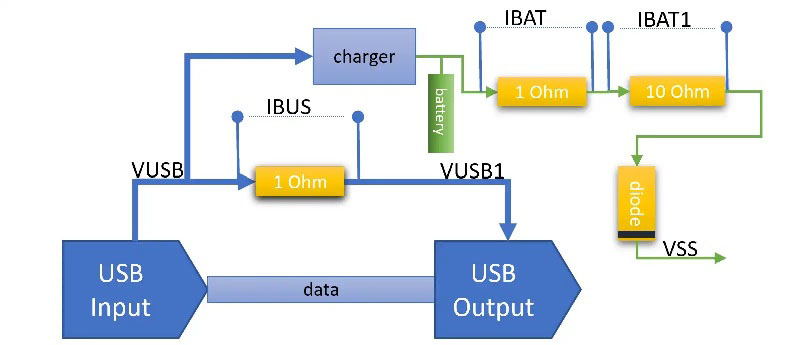

# USB_ITest
A USB charger and current probe design.

This project is a board for making any USB-based project LiPo-ready. It contains a LiPo charger circuit and voltage provider (with current sensing) as well as a USB passthrough circuit (also with current sensing). So you can still use USB input for the project while charging the battery.

This is specifically designed to work out-of-the-box with a Raspberry Pi Pico or Pico W, which needs the output blocking diode.

This contains the importable schematic, layout, bom, and gerbers from EasyEDA for direct production by JLCPCB.
